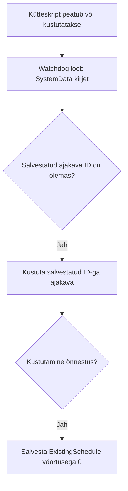

# Nutikas ja odav börsihinna järgi kütmine Shellyga

> [!TIP]
> Skript valib küttetunnid Eleringi börsihindade, määratud kütteperioodide ja soovi korral ilmaprognoosi põhjal.

> [!IMPORTANT]
> Alates 1. oktoobrist 2025 kasutab Elering 15-min elektrihinda, mis tähendab, et nende API struktuur on muutunud. Et sinu Shelly automatiseerimine töötaks edasi, pead:
>
> ✅ Uuendama oma Shelly skripti
>
> * Minimaalne nõutud versioon: 4.8 või uuem
> * Põhjus: Vanemad skriptid eeldavad tunnipõhiseid hindu, kuid nüüd tagastab API 15-minutilisi intervalle.

> [!IMPORTANT]
> Veerandtunni hindade vastuses on neli korda rohkem ridu kui tunnihindade vastuses. Selle versiooni maksimaalset mälukasutust ei ole Shelly seadmel mõõdetud. Enne mitme skripti kasutamist kontrolli oma seadmel `mem_used` ja `mem_peak` väärtusi.

- [Nutikas ja odav börsihinna järgi kütmine Shellyga](#nutikas-ja-odav-börsihinna-järgi-kütmine-shellyga)
  - [Põhifunktsioonid](#põhifunktsioonid)
  - [Ajakava jälgimine ja muutmine](#ajakava-jälgimine-ja-muutmine)
  - [Skripti parameetrite konfigureerimine](#skripti-parameetrite-konfigureerimine)
    - [Virtuaalkomponentide häälestamine](#virtuaalkomponentide-häälestamine)
    - [Skripti KVS häälestamine](#skripti-kvs-häälestamine)
      - [Kütteparameetrid](#kütteparameetrid)
      - [``"EnergyProvider": "VORK1"``](#energyprovider-vork1)
      - [``"AlwaysOnPrice": 10``](#alwaysonprice-10)
      - [``"AlwaysOffPrice": 300``](#alwaysoffprice-300)
      - [``"InvertedRelay": false``](#invertedrelay-false)
      - [``"RelayId": 0``](#relayid-0)
      - [``"Country": "ee"``](#country-ee)
      - [``"HeatingCurve": 0``](#heatingcurve-0)
    - [Virtuaalkomponentide paigaldamine ja taastamine](#virtuaalkomponentide-paigaldamine-ja-taastamine)
- [Kuidas seda skripti installida](#kuidas-seda-skripti-installida)
  - [Paigaldamine](#paigaldamine)
  - [Kuidas panna tööle kaks installatsiooni](#kuidas-panna-tööle-kaks-installatsiooni)
  - [Skripti uuendamine](#skripti-uuendamine)
  - [Kuidas skript töötab](#kuidas-skript-töötab)
  - [Oluline teada](#oluline-teada)
  - [Testitud rikkestsenaariumid](#testitud-rikkestsenaariumid)
- [Maasoojuspumpade Thermia Villa & Eko Classic nutikas kütmine Shelly abil](#maasoojuspumpade-thermia-villa--eko-classic-nutikas-kütmine-shelly-abil)
- [Nutikad kütte algoritmid](#nutikad-kütte-algoritmid)
  - [Ilmaprognoosi algoritm](#ilmaprognoosi-algoritm)
    - [Shelly geograafiline asukoht](#shelly-geograafiline-asukoht)
    - [Küttegraafik](#küttegraafik)
  - [Ajaperioodi algoritm](#ajaperioodi-algoritm)
- [Kas see tõesti vähendab minu elektriarveid](#kas-see-tõesti-vähendab-minu-elektriarveid)
- [Tõrkeotsing](#tõrkeotsing)
  - [Viga "Couldn't get script"](#viga-couldnt-get-script)
- [Litsents](#litsents)
- [Autor](#autor)

## Põhifunktsioonid

1. **Ilmaprognoosiga küte:** arvutab küttetundide arvu prognoositava tajutava temperatuuri järgi.
2. **Fikseeritud kütteperioodid:** valib odavaimad tunnid määratud perioodi sees (KVS-is 1–24 täistundi; rakenduses 6, 12 või 24).
3. **Hinnapiirid:** lisab või välistab küttetunde määratud börsihinna lävendite järgi.
4. **Kaks skripti ühel seadmel:** võimaldab juhtida eri küttevajadusi; vaata [kahe installatsiooni juhiseid](#kuidas-panna-tööle-kaks-installatsiooni).

<a name="jälgimine-ja-ajakava-muutmine"></a>
<a name="kuidas-kontrollida-ajakava"></a>
<a name="kuidas-kontrollida-et-skript-töötab"></a>
<a name="advanced--key-value-storage--script-data"></a>
## Ajakava jälgimine ja muutmine

Skript kasutab üht ajakava, mis sisaldab kõiki valitud küttetunde.

1. Ava Shelly rakenduses või seadme veebilehel **Schedules**.
2. Ava skripti ajakava ja klõpsa **Time**, et näha valitud tunde.

| Ava ajakava | Vaata ja muuda tunde |
| --- | --- |
|  |  |

Tundide käsitsi lisamiseks või eemaldamiseks klõpsa neile ja vali **Next → Next → Save**. Muudatused kehtivad kuni skript asendab ajakava järgmise arvutuse järel.

Seadme veebilehel **Advanced → KVS** asub üks JSON-kirje `SmartHeatingSys<ScriptId>`, näiteks `SmartHeatingSys1` skripti ID 1 jaoks:

| Väli | Tähendus |
| --- | --- |
| `ExistingSchedule` | Skripti ajakava salvestatud ID; `0` tähendab, et ajakava pole salvestatud. |
| `LastCalculation` | Viimase salvestatud ajastamistulemuse ajatempel. |
| `Version` | Kirje salvestanud kütteskripti versioon. |

`LastCalculation` märgib hinnapõhise ajakava, varuajakava, küttetundideta tulemuse või ajakava loomise ebaõnnestumise aega. Salvestamise korduskatsetel ajatempel ei muutu: see näitab tulemuse, mitte hilisema salvestamise aega. See ei kinnita edukat hindade päringut ega tegelikku kütmist.

Pärast kütte ajakava edukat kustutamist seab watchdog tingimusliku kirjutamisega `ExistingSchedule` väärtuseks `0`, jättes `LastCalculation` muutmata. Kui teine arvutus on kirjet muutnud või KVS ei tagasta `etag` väärtust, jääb kirje puutumata. Vigane JSON või ajakava ID logitakse, kuid teiste skriptide ajakavade puhastamine jätkub. Hilinenud kustutamine jäetakse vahele, kui kütteskript kontrolli hetkel juba töötab.


## Skripti parameetrite konfigureerimine

<a name="skripti-virtual-componentide-häälestamine"></a>
### Virtuaalkomponentide häälestamine

Virtuaalkomponendid võimaldavad muuta üheksat kütteseadet Shelly rakenduses. `RelayId` valitakse mõlemas režiimis KVS-kirjes.

Virtuaalkomponendid on saadaval Gen2 Pro seadmetel alates püsivarast 1.4.3 ning Gen3/Gen4 seadmetel põlvkonna järgi. Kui KVS-režiim pole käsitsi valitud, kasutatakse olemasolevate juhtkomponentide kütteseadeid. Kui juhtkomponente pole ning salvestatud KVS-seadistus on täielik ja korrektne, jääb see aktiivseks; skript ei asenda seda vaikeväärtustega. Paigaldusjuhend eeldab püsivara 1.4.4 või uuemat; see režiimi valiku kontroll ei ole täielik ühilduvustest.


<a name="kuidas-panna-skript-tööle-kvs-modes"></a>
<a name="kuidas-panna-skript-tööle-kvs-modes-1"></a>
### Skripti KVS häälestamine

KVS-režiimis ava seadme veebilehel **Advanced → KVS**. Seaded asuvad JSON-kirjes `SmartHeatingConf<ScriptId>`, näiteks `SmartHeatingConf1` skripti ID 1 jaoks. KVS-režiimi saab kasutada ka virtuaalkomponentidega seadmel, näiteks teise kütteskripti jaoks.

- **Uus paigaldus:** määra [skriptis](SmartHeatingWithShelly.js) enne esimest käivitamist `mnKv: true`. Esimesel seadistuse salvestamisel saab sellest `ManualKVS` väärtus.
- **Olemasolev KVS-paigaldus:** säilita kogu seadistuskirje, sea `ManualKVS` väärtuseks `true` ja taaskäivita skript. Salvestatud tõeväärtus on skripti algväärtusest ülimuslik.
- **Üleminek virtuaalkomponentidelt:** kirje võib sisaldada vaid `{ "ManualKVS": false, "RelayId": 0 }`. KVS-režiim nõuab lisaks relee ID-le kõiki üheksat kütteseadet. Kopeeri juhtkomponentide praegused väärtused KVS-kirjesse, säilita `RelayId`, sea `ManualKVS` väärtuseks `true` ja taaskäivita skript.

Olemasolevad virtuaalkomponendid jäävad seadmesse alles, kuid nende väärtuste muutmine rakenduses ei mõjuta kütmist, kui skript töötab KVS-režiimis.

Näidiskonfiguratsioon: kohanda väärtused oma paigaldusele. Virtuaalkomponentidelt üleminekul kasuta nende praeguseid väärtusi.

```json
{
  "TimePeriod": 24,
  "HeatingTime": 10,
  "IsForecastUsed": false,
  "EnergyProvider": "VORK2",
  "AlwaysOnPrice": 1,
  "AlwaysOffPrice": 300,
  "InvertedRelay": false,
  "RelayId": 0,
  "Country": "ee",
  "HeatingCurve": 0,
  "ManualKVS": true
}
```

Arvud sisesta JSON-arvudena (`10`), tõeväärtused kujul `true` või `false`. Igas salvestatud konfiguratsioonis peab `RelayId` olema mittenegatiivne täisarv; puuduvat väärtust ei asendata nulliga. Uuel paigaldusel kasutatakse skripti algset `rId` väärtust (vaikimisi `0`). Vigased seaded jäetakse parandamiseks alles.


<a name="heating-parameters"></a>
#### Kütteparameetrid

`TimePeriod` lubab KVS-is täisarve **0 kuni 24**, sealhulgas 4 ja 8; virtuaalkomponentides saab valida **0, 6, 12 või 24**. Null valib ainult hinnapiiridel põhineva režiimi. Perioodid algavad keskööl; kui 24 ei jagu perioodi pikkusega, lõpeb viimane periood keskööl. Prognoosita määrab `HeatingTime` valitavate tundide arvu perioodis; prognoosiga on see miinimum, mida rakendatakse ainult positiivse küttevajaduse korral. Hinnapiirid võivad valitud tundide arvu muuta. Tabeli kasutusnäited on lähtepunkt seadistamiseks.

| Kütte režiim | Kirjeldus | Parim kasutus |
| --- | --- | --- |
| ``"TimePeriod": 24,``<br>``"HeatingTime": 10,`` <br>``"IsForecastUsed": true`` | Kütmise aeg **24-tunnise** perioodi kohta sõltub **prognoositud tajutavast temperatuurist**. | Betoonpõranda kütmine või suur veepaak, mis suudab hoida soojusenergiat vähemalt 10–15 tundi. |
| ``"TimePeriod": 12,``<br>``"HeatingTime": 5,``<br>``"IsForecastUsed": true`` | Kütmise aeg iga **12-tunnise** perioodi kohta sõltub **prognoositud tajutavast temperatuurist**. | Kipsivalu põrandaküte või veepaak, mis suudab hoida soojusenergiat 5–10 tundi. |
| ``"TimePeriod": 6,``<br>``"HeatingTime": 2,``<br>``"IsForecastUsed": true`` | Kütmise aeg iga **6-tunnise** perioodi kohta sõltub **prognoositud tajutavast temperatuurist**. | Õhk-soojuspumbad, radiaatorid või põrandaküttesüsteemid väikese veepaagiga, mis suudab hoida energiat 3–6 tundi. |
| ``"TimePeriod": 24,``<br>``"HeatingTime": 20,``<br>``"IsForecastUsed": false`` | Küte on aktiveeritud **20** kõige odavamal tunnil päevas. | Näiteks ventilatsioonisüsteem. |
| ``"TimePeriod": 24,``<br>``"HeatingTime": 12,``<br>``"IsForecastUsed": false`` | Küte on aktiveeritud **12** kõige odavamal tunnil päevas. | Suur veepaak 1000L või rohkem. |
| ``"TimePeriod": 12,``<br>``"HeatingTime": 6,``<br>``"IsForecastUsed": false`` | Küte on aktiveeritud **kuuel** kõige odavamal tunnil igas **12-tunnises** perioodis. | Suur veepaak 1000L või rohkem, suure kasutusega. |
| ``"TimePeriod": 12,``<br>``"HeatingTime": 2,``<br>``"IsForecastUsed": false`` | Küte on aktiveeritud **kahel** kõige odavamal tunnil igas **12-tunnises** perioodis. | Väike 150L veeboiler väikesele majapidamisele. |
| ``"TimePeriod": 6,``<br>``"HeatingTime": 2,``<br>``"IsForecastUsed": false`` | Küte on aktiveeritud **kahel** kõige kulutõhusamal tunnil igas **6-tunnises** perioodis. | Suur 200L veeboiler neljale või enamale inimesele mõeldud majapidamisele. |
| ``"TimePeriod": 0,``<br>``"HeatingTime": 0,``<br>``"IsForecastUsed": false`` | Küte valitakse tundidel, mil ümardatud börsihind on `AlwaysOnPrice` väärtusest väiksem või sellega võrdne, kui samal ajal ei rakendu `AlwaysOffPrice`. |

#### ``"EnergyProvider": "VORK1"``

Vali tabelist täpne `EnergyProvider` väärtus. `NONE` jätab võrgutasu arvestamata. Summad on **skripti seadistatud võrgutasud, EUR/MWh ilma käibemaksuta**; kontrolli oma paketi kehtivaid hindu [Elektrilevi](https://elektrilevi.ee/en/vorguleping/vorgupaketid/eramu) või [Imatra](https://imatraelekter.ee/vorguteenus/vorguteenuse-hinnakirjad/) lehelt.

| Võrgupakett | Kirjeldus | |
| - | - | :-: |
| ``VORK1`` | **Elektrilevi**<br> Päev/öö 77.2 EUR/MWh |  |
| ``VORK2`` | **Elektrilevi**<br> Päeval 60.7 EUR/MWh <br> Öösel 35.1 EUR/MWh |  |
| ``VORK4`` | **Elektrilevi**<br> Päeval 36.9 EUR/MWh <br> Öösel 21 EUR/MWh |  |
| ``VORK5`` | **Elektrilevi**<br> Päeval 52.9 EUR/MWh <br> Öösel 30.3 EUR/MWh <br> Tööpäeva tipp 81.8 EUR/MWh <br> Nädalavahetuse tipp 47.4 EUR/MWh |   |
| ``PARTN24`` | **Imatra**<br> Päev/öö 60.7 EUR/MWh | |
| ``PARTN24PL`` | **Imatra**<br> Päev/öö 38.6 EUR/MWh | |
| ``PARTN12`` | **Imatra**<br> Päeval 72.4 EUR/MWh <br> Öösel 42 EUR/MWh | Suveaeg päev: E-R kell 8:00–24:00.<br>Öö: E-R kell 0:00–08:00, L-P terve päev <br> Talveaeg päev: E-R kell 7:00–23:00.<br>Öö: E-R kell 23:00–7:00, L-P terve päev |
| ``PARTN12PL`` | **Imatra**<br> Päeval 46.4 EUR/MWh <br> Öösel 27.1 EUR/MWh | Suveaeg päev: E-R kell 8:00–24:00.<br>Öö: E-R kell 0:00–08:00, L-P terve päev <br> Talveaeg päev: E-R kell 7:00–23:00.<br>Öö: E-R kell 23:00–7:00, L-P terve päev |
| ``PAMATA1`` | Läti, Pamata-1; skripti seadistatud võrgutasu 39.62 EUR/MWh | Kõik tunnid |
| ``SPECIAL1`` | Läti, Speciālais 1; skripti seadistatud võrgutasu 158.48 EUR/MWh | Kõik tunnid |
| ``NONE`` | Võrgutasu on 0 ||

Elektrilevi öötasu kehtib tööpäeviti 22:00–07:00 ja nädalavahetusel, välja arvatud VORK5 tiputunnid. VORK5 tiputunnid on novembrist märtsini tööpäeviti 09:00–12:00 ja 16:00–20:00 ning nädalavahetusel 16:00–20:00. Skript ei erista riigipühi.

#### ``"AlwaysOnPrice": 10``

Enne lävenditega võrdlemist ümardatakse börsihind kahe komakohani. Küte on sees, kui ümardatud börsihind on sellest väärtusest väiksem või sellega võrdne (EUR/MWh), välja arvatud juhul, kui rakendub ka ``AlwaysOffPrice``.

#### ``"AlwaysOffPrice": 300``

Küte on väljas, kui ümardatud börsihind on sellest väärtusest suurem või sellega võrdne (EUR/MWh). Kui mõlemad lävendid rakenduvad, on ``AlwaysOffPrice`` prioriteetne.

#### ``"InvertedRelay": false``

Konfigureerib relee oleku kas normaalseks või pööratud.

- ``true`` - Pööratud relee olek. Seda nõuavad mitmed maasoojuspumbad nagu Nibe või Thermia.
- ``false`` - Normaalne relee olek, seda kasutatakse veeboilerite või elektrilise põrandakütte puhul.

#### ``"RelayId": 0``

Shelly relay ID on vaikimisi 0, kuid mitme väljundiga Shelly puhul tähistab see relee ID numbrit.

#### ``"Country": "ee"``

Börsihinna riik. Toetatud väärtused:

- `ee` – Eesti
- `fi` – Soome
- `lt` – Leedu
- `lv` – Läti

#### ``"HeatingCurve": 0``

Mõjutab prognoosist arvutatud küttevajadust; vaikimisi `0`. Üks samm lisab arvutatud päevasele vajadusele kaks tundi enne perioodideks jagamist ja piirangute rakendamist. Sooja ilma piir, miinimum ja perioodi pikkus võivad jätta tegelikud tunnid muutmata. Virtuaalkomponendis on vahemik **−4 kuni 8**; KVS-is sobib iga lõplik arv. Vaata [küttegraafiku arvutust ja näiteid](#küttegraafik).

### Virtuaalkomponentide paigaldamine ja taastamine

Virtuaalkomponentide paigaldus sõltub üheksa nõutud juhtkomponendi seisust. Konfiguratsiooni või SystemData lugemisviga või vigane kirje peatab ajakava uuendamise.

| Nõutud juhtkomponendid | Tegevus |
| --- | --- |
| Kõik üheksa on olemas ja korrektsed | Kasutatakse nende väärtusi kütte juhtimiseks. |
| Kõik üheksa puuduvad | Täielik ja korrektne salvestatud KVS-seadistus jääb aktiivseks. Muul juhul paigaldatakse vaikeväärtused. |
| Osa puudub | Ajakava uuendamine peatub ning teade **„Missing controls”** nimetab kõik puuduvad juhtkomponendid, sõltumata SystemData olemasolust. |
| Vigased või konfliktse nimega komponendid, ebaõnnestunud või mittetäielik lugemine | Komponente, releeseadeid ja ajakava ei muudeta. |

**„Schedule updates are paused”** tähendab, et ajakava ei uuendata. Varasem ajakava võib korrata vanu tunde; uuel paigaldusel võib ajakava puududa. Paranda teates nimetatud seade või komponent. Skript proovib uuesti iga viie minuti järel.

Mittetäieliku komponentide loendi korral juhtkomponente, releeseadeid ja ajakava ei muudeta; skript proovib lugemist viie minuti pärast uuesti. Taasta juhtkomponent käsitsi ainult siis, kui see tegelikult puudub.

Kui katkenud paigalduse järel on osa juhtkomponente puudu, ei taasta korduskatse ega taaskäivitus neid automaatselt. Taasta teates nimetatud juhtkomponendid käsitsi või [mine üle KVS-režiimi](#skripti-kvs-häälestamine), säilitades praegused seaded. Vaikeväärtustega paigalduseks või taaspaigalduseks varunda seaded, kustuta kõik üheksa nõutud juhtkomponenti ning asenda seadistuskirje kujuga `{ "ManualKVS": false, "RelayId": 0 }`, kasutades oma relee tegelikku ID-d. Taaskäivita skript ja seadista uued juhtkomponendid. **Säilita `SmartHeatingSys<ScriptId>` (SystemData): see sisaldab ajakava ID-d.** SystemData kustutamine ei taasta osalist juhtkomponentide komplekti. Kui ühtki juhtkomponenti ei jõutud luua, võib järgmine arvutus paigaldust uuesti proovida.

**„Group setup incomplete”** tähendab, et grupp vajab käsitsi seadistamist; kütte juhtimine saab jätkuda. Olemasoleva grupi nimi ja liikmed säilivad. Vajadusel loo grupp või lisa juhtkomponendid sinna käsitsi, ka siis, kui grupp jäi taaskäivituse tõttu puudu või tühjaks. Kui kõik juhtkomponendid on olemas, ei proovita gruppi järgmistel arvutustel ega taaskäivitustel uuesti seadistada.

SystemData kirjutamisvea korral proovitakse sama kirjet salvestada enne järgmist arvutust. Taaskäivitus või voolukatkestus enne õnnestunud salvestamist võib jätta ajakava ID salvestamata. Skript haldab ajakava salvestatud ID järgi ega otsi või taasta omanikuta ajakavasid. Relee polaarsuse muutmise ebaõnnestumisel võib varasem ajakava jääda välja lülitatuks kuni järgmise õnnestunud katseni.

# Kuidas seda skripti installida

## Paigaldamine

1. Hangi skriptimist toetav [Shelly Plus, Pro või Gen3 seade](https://www.shelly.com/collections/smart-switches-dimmers).
2. Ühenda seade koduvõrku. Vaata [Shelly veebiliidese juhendeid](https://kb.shelly.cloud/knowledge-base/web-interface-guides).
3. Ava **Settings → Device Information → Device IP** kaudu seadme veebileht ja vali **Scripts → Create Script**.
4. Ava [skript GitHubis](SmartHeatingWithShelly.js) ja vali **Copy raw file**.

   

5. Kleebi kood skripti aknasse (**Ctrl+V**), pane skriptile nimi ja salvesta.
6. Kui soovid uut paigaldust KVS-režiimis, määra enne käivitamist `mnKv: true`, nagu [KVS-i juhendis](#skripti-kvs-häälestamine).
7. Klõpsa **Start** ning seadista [virtuaalkomponendid](#virtuaalkomponentide-häälestamine) või [KVS](#skripti-kvs-häälestamine).

## Kuidas panna tööle kaks installatsiooni

Esimene installatsioon võib kasutada virtuaalkomponente; teine tuleb samal seadmel [määrata KVS-režiimi](#skripti-kvs-häälestamine). Mõlemad võivad kasutada KVS-i. Need võivad juhtida sama releed või mitme väljundiga seadmel eri releesid; vali kummagi jaoks `RelayId`.

[Shelly lubab korraga käitada kuni kolme skripti](https://shelly-api-docs.shelly.cloud/gen2/ComponentsAndServices/Script/). Kaks kütteskripti jagavad üht watchdog-skripti, täites kõik kolm kohta. Samal ajal ei saa käitada teisi skripte. Kontrolli ka seadme mälukasutust, nagu eespool kirjeldatud.

## Skripti uuendamine

Enne uuendamist kontrolli aktiivseid seadeid. KVS-is on lubatud `TimePeriod` täisarvulised väärtused **0 kuni 24**; senised 4- ja 8-tunnised perioodid jäävad toetatuks. `HeatingTime` määratakse iga perioodi kohta; perioodi muutmisel vaata üle ka see väärtus. Kui uuendus teeb virtuaalkomponendid kättesaadavaks, jääb täielik ja korrektne KVS-seadistus aktiivseks, kuni juhtkomponente pole.

Enne uuendamist kontrolli ka [seadistuskirjet](#skripti-kvs-häälestamine): arvud peavad olema JSON-arvud, tõeväärtused `true` või `false`, `Country` toetatud riigikood ja `RelayId` mittenegatiivne täisarv. Virtuaalkomponentide režiimis peavad salvestatud režiim ja relee ID olema korrektsed. Õiged paketinimed on `PARTN24PL` ja `PARTN12PL`; varasema juhendi lühemad kirjapildid olid vead.

Veel avaldamata versioon **5** eemaldab automaatse taastamise varukoopiast. Tühja stringina salvestatud ajakava ID tähendab ajakava puudumist ainult siis, kui kirje arvuline versioon on vähemalt 4.2 ja alla 5. Nullväärtus, puuduv ID ja muud vigased ID-d peatavad uuendamise. See ühilduvusreegel kehtib ainult olemasolevale `SmartHeatingSys<ScriptId>` kirjele. `SmartHeatingVC<ScriptId>` on aegunud: skript ei loe ega kirjuta seda võtit ning selle võib kustutada. Olemasolevate juhtkomponentide väärtused säilivad.

> [!WARNING]
> Otsest uuendamist versioonilt 4.1 ei toetata, sest KVS-i andmevorming muutus JSON-iks. Pärast paigaldamist seadista kõik väärtused uuesti KVS-is või virtuaalkomponentides.

1. Ava [skript GitHubis](SmartHeatingWithShelly.js) ja vali **Copy raw file**.
2. Ava seadme veebileht **Settings → Device Information → Device IP** kaudu ja vali **Scripts**.
3. Ava uuendatav skript, vali kogu kood (**Ctrl+A**) ja kustuta see.
4. Kleebi uus kood (**Ctrl+V**) ja salvesta.
5. KVS-is või virtuaalkomponentides salvestatud seaded säilivad. Kontrolli nende sobivust ülaltoodud nõuetega ning [vaata ajakava](#ajakava-jälgimine-ja-muutmine).

Paigalduse probleemide korral vaata [virtuaalkomponentide taastamise juhiseid](#virtuaalkomponentide-paigaldamine-ja-taastamine).

## Kuidas skript töötab

Skript vajab internetti [Eleringi hindade](https://dashboard.elering.ee/assets/api-doc.html#/nps-controller/getPriceUsingGET) ja soovi korral [Open-Meteo ilmaprognoosi](https://open-meteo.com/en/docs) laadimiseks. See arvutab ajakava käivitamisel ja uuendab seda pärast kella 23:00; prognoosiga lühemates režiimides ka enne järgmist kütteperioodi.

Hinnavastus peab sisaldama kohaliku päeva kõiki 92, 96 või 100 veerandtundi. Vanu tunnihindade vastuseid ei toetata. Sügisesel kellakeeramisel kasutatakse korduva tunni esimese esinemise hinda, sest [Shelly ajakava käivitub ainult sellel esimesel korral](https://shelly-api-docs.shelly.cloud/gen2/ComponentsAndServices/Schedule/). Ka teise esinemise kõik veerandtunnid kontrollitakse üle. Kevadisel kellakeeramisel on ajastatavaid tunde 23.

Töötav watchdog jälgib kütteskripti peatamist ja kustutamist:



## Oluline teada

- Skript püüab lubada enda ja watchdog-skripti automaatse käivitumise. Kontrolli pärast püsivara uuendamist, et **Run on startup** oleks mõlemal lubatud.
- Kütteskripti peatamisel või kustutamisel eemaldab töötav watchdog selle salvestatud ajakava. Watchdog'i paigalduse või kustutamise tõrked on logis; ainult kütteskripti peatamine ei kinnita ajakava kustutamist.
- Skript haldab ajakava SystemData kirjes oleva ID järgi. Säilita see kirje, ka juhtkomponentide taastamisel.

## Testitud rikkestsenaariumid

- Kui ajaperioodiga režiimis ei saa hindu või vajalikku ilmaprognoosi, koostab skript iga perioodi jaoks varuajakava ajaloolise hinnajärjestuse ja `HeatingTime` alusel. Valik piirdub selle perioodi tundidega. Väärtus `HeatingTime: 0` eemaldab sel juhul kütte ajakava.
- Ainult hinnapiiridel põhinevas režiimis (`TimePeriod: 0`) peatub hindade puudumisel ajakava uuendamine. Olemasolev ajakava ja releeseaded säilivad; varuajakava ei kasutata.
- Konfiguratsiooni või SystemData lugemisvea korral väljastatakse **„Schedule updates are paused”**. Juhtkomponendid, releeseaded ja ajakava jäävad muutmata.
- Voolukatkestuse järel ootab skript seadme kellaaega umbes 30 sekundit. Kui kellaaega ikka pole, kasutab ajaperioodiga režiim ülaltoodud varuajakava; ainult hinnapiiridel põhinev režiim peatab uuendamise.
- Kellaaja sünkroonimisel proovib skript uuesti arvutada. Ebaõnnestunud päringuid proovitakse uuesti viieminutilise intervalliga ka pärast südaööd, kui tõrge algas eelmisel õhtul. Korduv tõrge säilitab paigaldatud varuajakava, mitte ei loo seda uuesti.

# Maasoojuspumpade Thermia Villa & Eko Classic nutikas kütmine Shelly abil

Kontrolli ühendusi oma soojuspumba paigaldusjuhendi järgi.

Thermia Villa ja Thermia Eko Classic on küll suhteliselt vanad, kuid siiski hästi töötavad ja päris populaarsed maasoojuspumbad.
Käesolev juhis nõustab kuidas need soojuspumbad Shelly abil nutikalt kütma panna.

Instruktsioonid ja ühendused
(Esiteks mõlema soojuspumba installer manualist pilt.)

|Thermia Villa|Thermia Eko Classic|
|---|---|
|  |  |

Ühenda **kaks Shelly seadet** maasoojuspumba sees vastavalt **skeemile**.

 

Alljärgnevast tabelist leiad kuidas **häälestada oma Shelly seadmed**.
Mõlemale Shelly seadmele installeeri Smart Heating skript ja häälesta vastavalt kas kütte või sooja vee tootmise jaoks.

|Heatpump|Heating+Hot Water|only Hot Water|
|---|---|---|
|Thermia Villa|Shelly 1<br>``"InvertedRelay": true``|Shelly 2<br>``"InvertedRelay": true``|
|Thermia Eko Classic|Shelly 1<br>``"InvertedRelay": true``|Shelly 2<br>``"InvertedRelay": false``|

Siin on **soojuspumba tööolukorrad** lihtsalt infoks.

|Thermia Villa|Thermia Eko Classic|Shelly 1|Shelly 2|
|---|---|---|---|
|EVU Stop <br>No heating or hot water|Hot water <br> Reduced Temperature|On|On|
|Hot Water<br> Reduced Temperature|EVU Stop<br>No heating or Hot water|On|Off|
|Normal heating <br>Normal Hot water|Normal heating <br>Normal Hot water|Off|On|
|Normal heating <br>Normal Hot water|Normal heating <br>Normal Hot water|Off|Off|

# Nutikad kütte algoritmid

<a name="ilmaprognoosipõhise-kütmise-eelised"></a>
## Ilmaprognoosi algoritm

Prognoosiga režiim kohandab kütteaja järgmise perioodi prognoositava tajutava temperatuuri järgi. Üle +16 °C seab algoritm prognoosipõhise küttevajaduse nulliks: näiteks +17 °C juures on see null, −5 °C juures suurem ning −20 °C juures veel suurem. Tegelikud tunnid sõltuvad ka küttegraafikust, miinimumist ja hinnapiiridest.

### Shelly geograafiline asukoht

> [!IMPORTANT]
> Veenduge, et teie Shelly seadmel oleks õige asukohateave, kontrollides Shelly &rarr; Seaded &rarr; Geolokatsioon &rarr; Laiuskraad/pikkuskraad.

Märkus: Shelly asukoht määratakse teie internetiteenuse pakkuja IP-aadressi põhjal, mis ei pruugi täpselt kajastada teie kodu asukohta. Kontrollige ja uuendage vajadusel laius- ja pikkuskraadi seadeid.

### Küttegraafik

`HeatingCurve` võimaldab kohandada küttevajadust hoone soojapidavuse järgi. Arvutus kasutab Open-Meteo tajutavat temperatuuri:

1. `T` on prognoositud tajutavate temperatuuride keskmine, ümardatud üles.
2. Päevane vajadus tundides = `(16 − T) × pFac + 2 × HeatingCurve − 2`. `pFac` on vaikimisi `0.5` ja seda muudetakse skriptis.
3. Kui `T > 16` või tulemus on negatiivne, on päevane vajadus `0`.
4. Jaga päevane vajadus perioodide arvuga (`24 / TimePeriod`, ümardatud üles) ja ümarda tulemus alla.
5. Positiivse päevase vajaduse korral tõsta tulemus vajadusel miinimumini `HeatingTime`.
6. Tulemus ei tohi ületada perioodi pikkust.

Graafikud kasutavad `pFac: 0.5`, `HeatingTime: 0` ja `HeatingCurve` väärtusi −4 kuni 8. Tunnid ümardatakse alla ning ülempiir on perioodi pikkus. Positiivse küttevajaduse korral võib määratud miinimum tundide arvu suurendada; hinnapiirid rakenduvad hiljem.


## Ajaperioodi algoritm

> See algoritm jagab päeva perioodideks, aktiveerides kütte kõige odavamatel tundidel igas perioodis. See sobib hästi kasutusjuhtudeks, nagu kuumavee boilerid, kus kasutus sõltub majapidamise suurusest ja mitte välistemperatuurist. Vali perioodi pikkus ja küttetunnid vastavalt majapidamise vajadustele.

Igas kütteperioodis valitakse võrdse arvutatud hinnaga (koos võrgutasuga) tundidest esmalt hilisemad; alati sisse- ja väljalülitamise hinnareeglid kehtivad endiselt.

* 24-tunnine graafik ja kuidas 10 kõige odavamat tundi valitakse, on näitena kujutatud järgmisel pildil. Punane tähistab kütmiseks kasutatavaid tunde.


# Kas see tõesti vähendab minu elektriarveid

Sääst sõltub paigalduse ja lepingu tingimustest. Lahendus sobib eelkõige siis, kui:

- sul on börsihinnaga elektrileping;
- kütmist saab nihutada odavamatele tundidele;
- perioodide vahel jätkub salvestatud soojust või sooja vett;
- valitud võrgupakett vastab sinu lepingule, sest võrgutasud võivad tundide hinnajärjestust muuta.

Väiksem elektriarve ega muutumatu tarbimine ei ole garanteeritud. Hinda tulemust oma tarbimise, kulude ja mugavuse järgi. Hindu saad vaadata [Eleringi lehelt](https://dashboard.elering.ee/et/nps/price).

# Tõrkeotsing

## Viga "Couldn't get script"

Shelly süsteemis on probleem, mis võib mõjutada teie kogemust skriptide avamisel Shelly pilve või mobiilirakenduse kaudu. Tekkinud viga "Couldn't get script" on teadaolev bugi, mis takistab skriptide avamist, mis on suuremad kui 15kB nende platvormide kaudu.

Selle ebamugavuse ületamiseks soovitame järgmisi lahendusi:

1. Avage skript seadme veebilehe kaudu:
Juurdepääs seadme veebilehele võimaldab teil edukalt avada mis tahes skripti. See meetod pakub otsest ja usaldusväärset lahendust, et vaadata ja hallata oma skripte sujuvalt.

2. Alternatiivne lahendus Shelly pilve kaudu:
Kui seadme veebilehele juurdepääs ei ole võimalik, järgige neid samme Shelly pilves:

   1. Kustutage olemasolev skript.
   2. Looge uus skript.
   3. Kopeerige ja kleepige kogu skript skripti aknasse.
   4. Salvestage ja sulgege skript.
   5. Käivitage skript.

    Kui selle protsessi käigus tekib probleeme, saate seda lahendust korrata, alustades skripti kustutamise sammust.


# Litsents

See projekt on litsentseeritud MIT litsentsi alusel. Vaadake [LITSENTS](LICENSE) faili üksikasjade saamiseks.

# Autor

Loodud Leivo Sepp, 2024-2025

[Smart heating management with Shelly - GitHub Repository](https://github.com/LeivoSepp/Smart-heating-management-with-Shelly)
