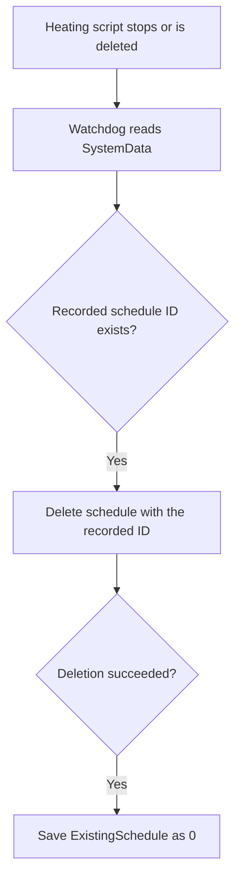
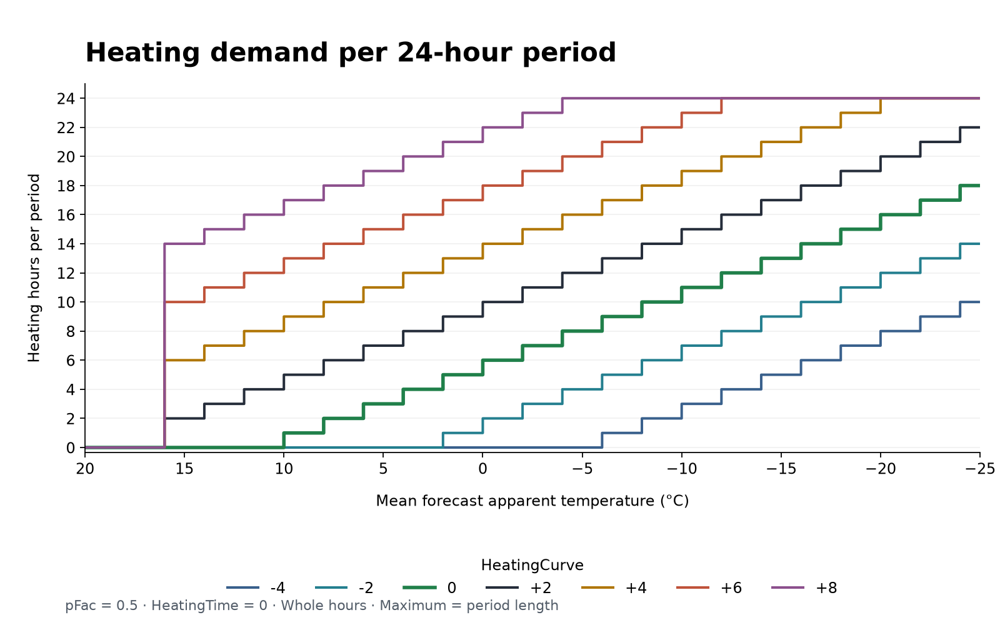
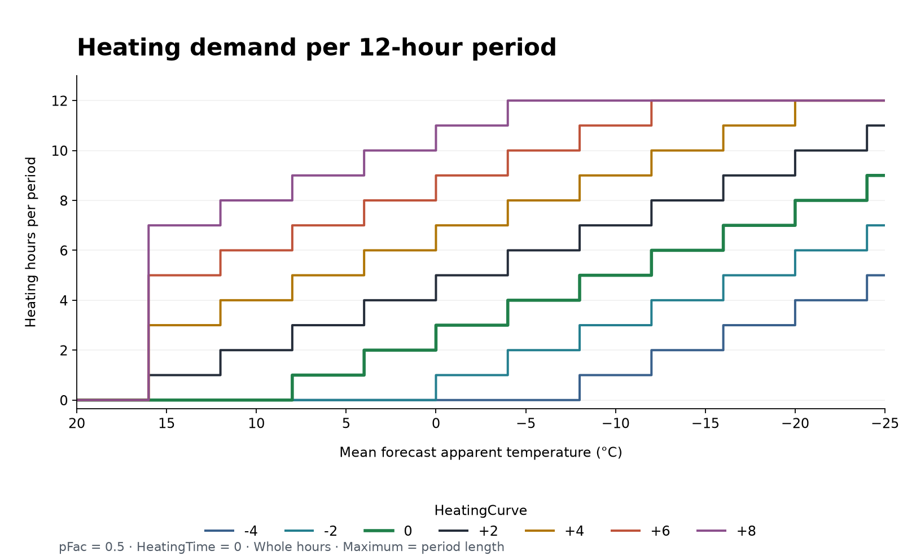
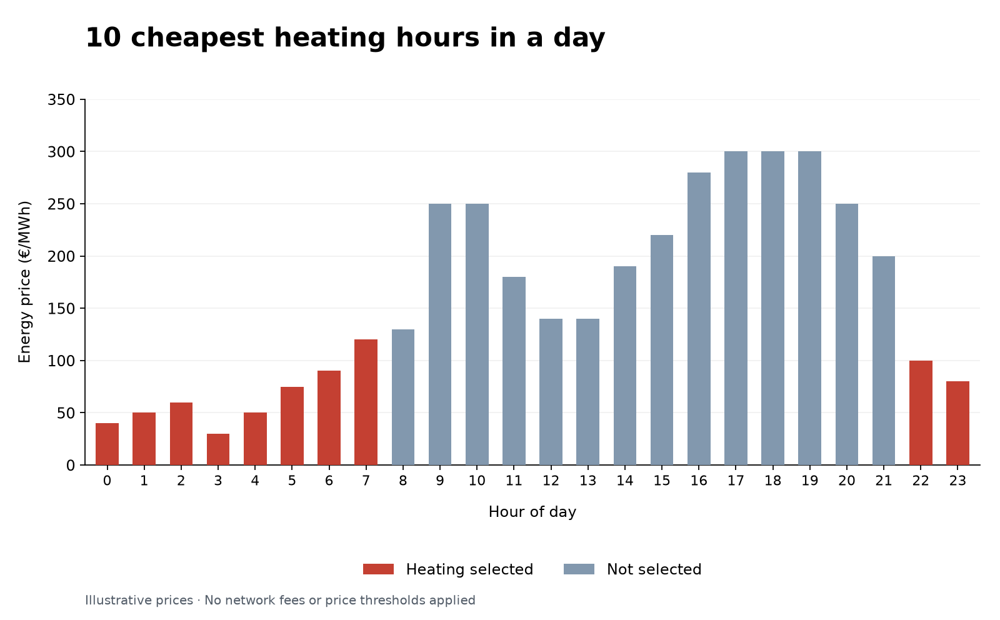

# Smart and cheap heating with Shelly

> [!TIP]
> This script selects heating hours using Elering electricity prices, fixed heating periods and optional weather forecasts.

> [!IMPORTANT]
> Starting October 1, 2025, Elering switched to 15-min electricity price intervals, which means their API structure has changed. To keep your Shelly automation working, you need to:
>
> ✅ Update Your Shelly Script
> * Minimum required version: 4.8 or later
> * Reason: Older scripts assume hourly prices, but now the API returns 15-minute intervals.

> [!IMPORTANT]
> Quarter-hour prices contain four times as many rows as hourly prices. Peak memory for this version has not been measured on a Shelly device. Check `mem_used` and `mem_peak` on your device before relying on multiple instances.

- [Smart and cheap heating with Shelly](#smart-and-cheap-heating-with-shelly)
  - [Key Features](#key-features)
  - [Monitoring and editing the schedule](#monitoring-and-editing-the-schedule)
  - [Configuring Script parameters](#configuring-script-parameters)
    - [Configuration using Virtual Components](#configuration-using-virtual-components)
    - [Configuration using KVS](#configuration-using-kvs)
      - [Heating parameters](#heating-parameters)
      - [``"EnergyProvider": "VORK1"``](#energyprovider-vork1)
      - [``"AlwaysOnPrice": 10``](#alwaysonprice-10)
      - [``"AlwaysOffPrice": 300``](#alwaysoffprice-300)
      - [``"InvertedRelay": false``](#invertedrelay-false)
      - [``"RelayId": 0``](#relayid-0)
      - [``"Country": "ee"``](#country-ee)
      - [``"HeatingCurve": 0``](#heatingcurve-0)
    - [Virtual Component installation and recovery](#virtual-component-installation-and-recovery)
- [How to Install this Script](#how-to-install-this-script)
  - [Installation](#installation)
  - [How to run two instances of this script](#how-to-run-two-instances-of-this-script)
  - [Updating Script](#updating-script)
  - [How the Script Operates](#how-the-script-operates)
  - [Important To Know](#important-to-know)
  - [Tested Failure Scenarios](#tested-failure-scenarios)
- [Smart Heating for Thermia Villa & Eko Classic Using Shelly](#smart-heating-for-thermia-villa--eko-classic-using-shelly)
- [Smart Heating Algorithms](#smart-heating-algorithms)
  - [Weather Forecast Algorithm](#weather-forecast-algorithm)
    - [Shelly Geolocation](#shelly-geolocation)
    - [Heating Curve](#heating-curve)
  - [Time Period Algorithm](#time-period-algorithm)
- [Does it Truly Reduce My Electric Bills](#does-it-truly-reduce-my-electric-bills)
- [Troubleshooting](#troubleshooting)
  - [Error "Couldn't get script"](#error-couldnt-get-script)
- [License](#license)
- [Author](#author)

## Key Features

1. **Forecast heating:** calculates heating hours from the forecast apparent temperature.
2. **Fixed heating periods:** selects the cheapest hours within each configured period (1–24 whole hours in KVS; 6, 12 or 24 in the app).
3. **Price thresholds:** adds or excludes heating hours based on market-price limits.
4. **Two instances on one device:** supports separate heating needs; see [running two instances](#how-to-run-two-instances-of-this-script).

<a name="monitoring-and-edit-schedule"></a>
<a name="how-to-check-the-heating-schedule"></a>
<a name="how-to-verify-script-execution"></a>
<a name="advanced--key-value-storage--script-data"></a>
## Monitoring and editing the schedule

The script uses one schedule containing all selected heating hours.

1. Open **Schedules** in the Shelly app or device web interface.
2. Open the script's schedule and click **Time** to see the selected hours.

| Open the schedule | Inspect and edit hours |
| --- | --- |
|  |  |

To add or remove hours manually, click them and select **Next → Next → Save**. Your edits remain until the script replaces the schedule after its next calculation.

In the device web interface, **Advanced → KVS** contains one JSON record named `SmartHeatingSys<ScriptId>`, for example `SmartHeatingSys1` for script ID 1:

| Field | Meaning |
| --- | --- |
| `ExistingSchedule` | The recorded ID of this script's schedule; `0` means no schedule is recorded. |
| `LastCalculation` | The timestamp of the latest recorded scheduling result. |
| `Version` | The heating script version that saved the record. |

`LastCalculation` records the time of a price-based schedule, an offline fallback, no heating hours, or a failed schedule creation. The timestamp stays the same through save retries, so it records the result time rather than the eventual save time. It does not prove that prices were retrieved successfully or that heating occurred.

After successfully deleting the heating schedule, the watchdog conditionally sets `ExistingSchedule` to `0` without changing `LastCalculation`. If another calculation has changed the record, or KVS returns no `etag`, it leaves the record untouched. Invalid JSON or schedule IDs are logged without stopping cleanup for other instances. Delayed cleanup is skipped when the target script is already running at the check.


## Configuring Script parameters

### Configuration using Virtual Components

Virtual Components let you change the nine heating settings in the Shelly app. `RelayId` is selected in the KVS record in both modes.

Virtual Components are available on Gen2 Pro devices with firmware 1.4.3 or newer, and on Gen3/Gen4 devices by generation. Unless KVS mode is forced, existing controls supply the heating settings. If no heating controls exist and the saved KVS configuration is complete and valid, it remains active; the script does not install defaults over it. These installation instructions require firmware 1.4.4 or newer; the mode-selection check is not a complete compatibility test.


<a name="how-to-force-script-to-kvs-mode"></a>
<a name="how-to-force-script-to-kvs-mode-1"></a>
### Configuration using KVS

In KVS mode, open **Advanced → KVS** in the device web interface. Settings are stored as JSON under `SmartHeatingConf<ScriptId>`, for example `SmartHeatingConf1` for script ID 1. You can use KVS mode on a device with Virtual Components, including for a second heating instance.

- **Fresh installation:** set `mnKv: true` in the [script](SmartHeatingWithShelly.js) before its first start. The initial configuration save records this as `ManualKVS`.
- **Existing KVS installation:** preserve the complete record, set `ManualKVS` to `true`, and restart the script. A saved boolean overrides the default in the script.
- **Switching from Virtual Components:** the saved record may contain only `{ "ManualKVS": false, "RelayId": 0 }`. KVS mode also requires all nine heating settings. Copy the current control values into the record, preserve `RelayId`, set `ManualKVS` to `true`, and restart the script.

Existing Virtual Components remain on the device, but changing their values in the app has no effect on heating while the script uses KVS mode.

Example configuration: adapt these values to your installation. When switching from Virtual Components, use their current values.

```json
{
  "TimePeriod": 24,
  "HeatingTime": 10,
  "IsForecastUsed": false,
  "EnergyProvider": "VORK2",
  "AlwaysOnPrice": 1,
  "AlwaysOffPrice": 300,
  "InvertedRelay": false,
  "RelayId": 0,
  "Country": "ee",
  "HeatingCurve": 0,
  "ManualKVS": true
}
```

Enter numbers as JSON numbers (`10`) and booleans as `true` or `false`. Every saved configuration requires a non-negative integer `RelayId`; an omitted value is not defaulted to zero. A fresh installation uses the script's initial `rId` value (`0` by default). Invalid settings are retained for you to correct.


#### Heating parameters

`TimePeriod` accepts whole numbers from **0 to 24** in KVS, including 4 and 8; Virtual Components offer **0, 6, 12 and 24**. Zero selects threshold-only mode. Periods start at midnight; if the period does not divide 24 evenly, the final period ends at midnight. Without forecasting, `HeatingTime` sets the hours selected per period; with forecasting, it is the minimum applied only when heating demand is positive. Price thresholds can change the selected hours. The uses below are starting points for configuration.

|Heating mode|Description|Proposed usage|
|---|---|---|
|``"TimePeriod": 24,``<br>``"HeatingTime": 10,`` <br>``"IsForecastUsed": true``|The heating time for **24-hour** period depends on the **forecast apparent temperature**.|Concrete floor heating system or big water tank capable of retaining thermal energy for a duration of at least 10 to 15 hours.|
|``"TimePeriod": 12,``<br>``"HeatingTime": 5,``<br>``"IsForecastUsed": true``|The heating time for each **12-hour** period depends on the **forecast apparent temperature**.|Gypsum (kipsivalu) floor heating system or water tank capable of retaining thermal energy for a duration of 5 to 10 hours.|
|``"TimePeriod": 6,``<br>``"HeatingTime": 2,``<br>``"IsForecastUsed": true``|The heating time for each **6-hour** period depends on the **forecast apparent temperature**.|Air source heat pumps, radiators or underfloor heating panels with small water tank capable of retaining energy for a duration of 3 to 6 hours.|
|``"TimePeriod": 24,``<br>``"HeatingTime": 20,``<br>``"IsForecastUsed": false``|Heating is activated during the **20** most cost-effective hours in a **day**.|Ventilation system.|
|``"TimePeriod": 24,``<br>``"HeatingTime": 12,``<br>``"IsForecastUsed": false``|Heating is activated during the **12** most cost-effective hours in a **day**.|Big water tank 1000L or more.|
|``"TimePeriod": 12,``<br>``"HeatingTime": 6,``<br>``"IsForecastUsed": false``|Heating is activated during the **six** most cost-effective hours within every **12-hour** period.|Big water tank 1000L or more with heavy usage.|
|``"TimePeriod": 12,``<br>``"HeatingTime": 2,``<br>``"IsForecastUsed": false``|Heating is activated during the **two** most cost-effective hours within every **12-hour** period. |A 150L hot water boiler for a little household.|
|``"TimePeriod": 6,``<br>``"HeatingTime": 2,``<br>``"IsForecastUsed": false``|Heating is activated during the **two** most cost-effective hours within every **6-hour** period.|A 200L hot water boiler for a household with four or more people.|
|``"TimePeriod": 0,``<br>``"HeatingTime": 0,``<br>``"IsForecastUsed": false``|Heating is selected when the rounded market price is at or below `AlwaysOnPrice`, unless `AlwaysOffPrice` also applies.|

#### ``"EnergyProvider": "VORK1"``

Use an exact `EnergyProvider` value from the table. `NONE` excludes transmission fees. Figures are **rates configured in the script, in EUR/MWh excluding VAT**; check your package against the current [Elektrilevi](https://elektrilevi.ee/en/vorguleping/vorgupaketid/eramu) or [Imatra](https://imatraelekter.ee/vorguteenus/vorguteenuse-hinnakirjad/) price list.

|Network package|Description||
|---|---|-|
|``VORK1``|Elektrilevi<br> Day and night basic rate 77.2 EUR/MWh|  |
|``VORK2``|Elektrilevi<br> Day 60.7 EUR/MWh <br> Night 35.1 EUR/MWh||
|``VORK4``|Elektrilevi<br> Day 36.9 EUR/MWh <br> Night 21 EUR/MWh||
|``VORK5``|Elektrilevi<br> Day 52.9 EUR/MWh <br> Night 30.3 EUR/MWh <br> Weekday peak 81.8 EUR/MWh <br> Weekend peak 47.4 EUR/MWh||
|``PARTN24``|Imatra<br> Day and night basic rate 60.7 EUR/MWh|  |
|``PARTN24PL``|Imatra<br> Day and night basic rate 38.6 EUR/MWh|  |
|``PARTN12``|Imatra<br> Day 72.4 EUR/MWh <br> Night 42 EUR/MWh| Summer Daytime: MO-FR at 8:00–24:00.<br>Summer Night time: MO-FR at 0:00–08:00, SA-SU all day <br> Winter Daytime: MO-FR at 7:00–23:00.<br>Winter Night time: MO-FR at 23:00–7:00, SA-SU all day |
|``PARTN12PL``|Imatra<br> Day 46.4 EUR/MWh <br> Night 27.1 EUR/MWh|Summer Daytime: MO-FR at 8:00–24:00.<br>Summer Night time: MO-FR at 0:00–08:00, SA-SU all day <br> Winter Daytime: MO-FR at 7:00–23:00.<br>Winter Night time: MO-FR at 23:00–7:00, SA-SU all day|
|``PAMATA1``|Latvia, Pamata-1; configured transfer rate 39.62 EUR/MWh|All hours|
|``SPECIAL1``|Latvia, Speciālais 1; configured transfer rate 158.48 EUR/MWh|All hours|
|``NONE``|Transmission fee is 0; it is excluded from ranking.||

Elektrilevi night rates apply on weekdays from 22:00–07:00 and at weekends, except during VORK5 peak hours. VORK5 peaks apply November–March: weekdays 09:00–12:00 and 16:00–20:00, weekends 16:00–20:00. The script has no public-holiday rule.

#### ``"AlwaysOnPrice": 10``

Market prices are rounded to two decimal places before threshold comparison. Keep heating on when the rounded electricity market price is at or below this value (EUR/MWh), unless ``AlwaysOffPrice`` also applies.

#### ``"AlwaysOffPrice": 300``

Keep heating OFF when the rounded electricity market price is at or above this value (EUR/MWh). This threshold takes precedence if both thresholds apply.

#### ``"InvertedRelay": false``

Configures the relay state to either normal or inverted.

* ``true`` - Inverted relay state. This is required by many heating systems like Nibe or Thermia.
* ``false`` - Normal relay state, used for water heaters.

#### ``"RelayId": 0``

Configures the Shelly relay ID when using a Shelly device with multiple relays. Default ``0``.

#### ``"Country": "ee"``

Specifies the country for energy prices. Only countries available in the Elering API are supported.

* ``ee`` - Estonia
* ``fi`` - Finland
* ``lt`` - Lithuania
* ``lv`` - Latvia

#### ``"HeatingCurve": 0``

Adjusts forecast heating demand; default `0`. One step adds two hours to calculated daily demand before division into periods and application of limits. The warm-weather cutoff, minimum and period length can leave actual hours unchanged. The virtual control accepts **−4 to 8**; KVS accepts any finite number. See the [heating-curve calculation and examples](#heating-curve).

### Virtual Component installation and recovery

Virtual Component installation depends on the state of the nine required controls. Failed or invalid configuration and SystemData reads pause schedule updates.

| Required controls | Action |
| --- | --- |
| All nine present and valid | Use their values for heating. |
| All nine absent | Keep a complete, valid saved KVS configuration active. Otherwise install defaults. |
| Some absent | Pause schedule updates and report **“Missing controls”**, naming every missing control, whether SystemData exists or not. |
| Invalid/conflicting controls or failed/incomplete reads | Pause without changing controls, relay settings or schedules. |

**“Schedule updates are paused”** means the schedule is not being updated. A previous schedule may repeat its old hours; a fresh installation may have no schedule. Correct the reported setting or control. The script retries every five minutes.

If the log reports an incomplete inventory, heating controls, relay settings and schedules remain unchanged; the script retries the read after five minutes. Restore a control manually only if it is actually missing.

If an interrupted installation leaves some controls missing, retries and restarts do not restore them automatically. Restore the named controls manually or [switch to KVS mode](#configuration-using-kvs), preserving your current settings. To intentionally install or reinstall defaults, back up your settings, delete all nine required controls, and replace the configuration record with `{ "ManualKVS": false, "RelayId": 0 }`, using your actual relay ID. Restart and configure the new controls. **Keep `SmartHeatingSys<ScriptId>` (SystemData): it holds the schedule ID.** Deleting SystemData does not repair a partial set of controls. If no controls were created, the next calculation can retry installation.

**“Group setup incomplete”** means grouping needs manual attention; heating can proceed. Existing groups retain their names and membership. Create the group or add controls manually if needed, including when a restart left the group absent or empty. Once all controls exist, later calculations and restarts do not retry grouping.

A failed SystemData write retries the same record before another calculation. A restart or power cut before the write succeeds can leave an unrecorded schedule. The script uses the recorded ID to manage its schedule; it does not discover or recover orphan schedules. After a failed polarity transition, the previous schedule may remain disabled until a successful retry.

# How to Install this Script

## Installation

1. Obtain a [Shelly Plus, Pro or Gen3 device](https://www.shelly.com/collections/smart-monitoring-saving-energy) that supports scripting.
2. Connect it to your home network. See the [Shelly web interface guides](https://kb.shelly.cloud/knowledge-base/web-interface-guides).
3. Open the device web interface through **Settings → Device Information → Device IP**, then select **Scripts → Create Script**.
4. Open the [script on GitHub](SmartHeatingWithShelly.js) and select **Copy raw file**.

   

5. Paste the code into the script window (**Ctrl+V**), name the script and save it.
6. For a new installation in KVS mode, set `mnKv: true` before starting, as described in the [KVS instructions](#configuration-using-kvs).
7. Click **Start**, then configure [Virtual Components](#configuration-using-virtual-components) or [KVS](#configuration-using-kvs).

## How to run two instances of this script

The first instance may use Virtual Components; the second must be explicitly [forced into KVS mode](#configuration-using-kvs) on the same device. Both may use KVS. They can target the same relay or different relays on a device with multiple outputs; select `RelayId` for each instance.

[Shelly permits up to three scripts running at once](https://shelly-api-docs.shelly.cloud/gen2/ComponentsAndServices/Script/). Two heating instances share one watchdog, occupying all three slots. No other script can run alongside them. Also check device memory usage as described above.

## Updating Script

Before upgrading, check the active settings. KVS accepts whole-hour `TimePeriod` values from **0 to 24**; existing 4- and 8-hour periods remain supported. `HeatingTime` is set per period, so review it when changing the period. An upgrade that makes Virtual Components available keeps a complete, valid KVS configuration active while no heating controls exist.

Also check the [configuration record](#configuration-using-kvs): use JSON numbers, `true` or `false` for booleans, a supported `Country`, and a non-negative integer `RelayId`. Saved mode and relay settings must be valid even in Virtual Component mode. The package names are `PARTN24PL` and `PARTN12PL`; shorter spellings in older instructions were errors.

Unreleased version **5** removes automatic restoration from backups. A legacy empty-string schedule ID is treated as no schedule only for numeric versions from 4.2 up to, but excluding, 5. Null, missing and other invalid IDs still pause updates. This compatibility rule applies only to the existing `SmartHeatingSys<ScriptId>` record. `SmartHeatingVC<ScriptId>` is obsolete: the script never reads or writes it, and you may delete it. Existing controls keep their values.

> [!WARNING]
> Direct upgrade from version 4.1 is not supported because the KVS format changed to JSON. After installation, reconfigure all settings in KVS or Virtual Components.

1. Open the [script on GitHub](SmartHeatingWithShelly.js) and select **Copy raw file**.
2. Open the device web interface through **Settings → Device Information → Device IP**, then select **Scripts**.
3. Open the script to update, select all code (**Ctrl+A**) and delete it.
4. Paste the new code (**Ctrl+V**) and save.
5. Settings stored in KVS or Virtual Components remain saved. Check them against the requirements above and [inspect the schedule](#monitoring-and-editing-the-schedule).

For installation problems, see [Virtual Component recovery](#virtual-component-installation-and-recovery).

## How the Script Operates

The script needs internet access for [Elering prices](https://dashboard.elering.ee/assets/api-doc.html#/nps-controller/getPriceUsingGET) and, when enabled, the [Open-Meteo forecast](https://open-meteo.com/en/docs). It calculates a schedule at startup and refreshes after 23:00; shorter forecast periods also refresh before the next heating period.

The price feed must contain all 92, 96 or 100 quarter-hour rows for the local day. Historical hourly responses are not supported. At the autumn clock change, the repeated hour uses its first occurrence's price because [Shelly cron runs it only once, at that first occurrence](https://shelly-api-docs.shelly.cloud/gen2/ComponentsAndServices/Schedule/). All quarters of the second occurrence are still validated. The spring day has 23 schedulable hours.

The running watchdog handles heating-script stop and deletion events:



## Important To Know

- The script attempts to enable autostart for itself and the watchdog. After a firmware update, check that **Run on startup** is enabled for both.
- When the heating script stops or is deleted, the running watchdog removes its recorded schedule. Watchdog installation or deletion failures are logged; stopping the heating script alone does not confirm schedule deletion.
- The script manages its schedule through the ID in SystemData. Preserve that record, including when restoring controls.

## Tested Failure Scenarios

- When prices or a required forecast are unavailable in a timed mode, the script selects fallback hours within each period using the historical price ranking and `HeatingTime`. Selection is limited to the hours available in that period. With `HeatingTime: 0`, this removes the heating schedule.
- In threshold-only mode (`TimePeriod: 0`), unavailable prices pause updates. The existing schedule and relay settings remain; there is no historical-hour fallback.
- Failed configuration or SystemData reads log **“Schedule updates are paused”** and leave heating controls, relay settings and schedules unchanged.
- After a power cut, the script waits about 30 seconds for device time. If time is still unavailable, timed modes use the fallback above; threshold-only mode pauses updates.
- When device time synchronizes, the script retries calculation. Failed requests are retried at five-minute intervals, including after midnight following an evening outage. Repeated failures retain the installed fallback rather than recreating it.

# Smart Heating for Thermia Villa & Eko Classic Using Shelly

Check the wiring against the installer manual of your heat pump.

Thermia Villa and Thermia Eko Classic are two old but still widely used ground heating systems.
This guide explains how to make these heat pumps smart using two Shelly devices.

Step-by-Step Instructions
(Including installer manual screenshots for reference.)

|Thermia Villa|Thermia Eko Classic|
|---|---|
|  |  |

Connect **two Shelly devices** inside the heat pump following the **schema below**.

 

Refer to the table below for **configuring the Shelly devices**.
Both Shelly devices must have Smart Heating script. Configure them according to heating or hot water production.

|Heatpump|Heating+Hot Water|only Hot Water|
|---|---|---|
|Thermia Villa|Shelly 1<br>``"InvertedRelay": true``|Shelly 2<br>``"InvertedRelay": true``|
|Thermia Eko Classic|Shelly 1<br>``"InvertedRelay": true``|Shelly 2<br>``"InvertedRelay": false``|

Below is the **heat pump operating guide** for reference.

|Thermia Villa|Thermia Eko Classic|Shelly 1|Shelly 2|
|---|---|---|---|
|EVU Stop <br>No heating or hot water|Hot water <br> Reduced Temperature|On|On|
|Hot Water<br> Reduced Temperature|EVU Stop<br>No heating or Hot water|On|Off|
|Normal heating <br>Normal Hot water|Normal heating <br>Normal Hot water|Off|On|
|Normal heating <br>Normal Hot water|Normal heating <br>Normal Hot water|Off|Off|

# Smart Heating Algorithms

<a name="advantages-of-weather-forecast-based-heating"></a>
## Weather Forecast Algorithm

Forecast mode adjusts heating time using the apparent-temperature forecast for the upcoming period. Above +16 °C, the algorithm sets forecast heating demand to zero: at +17 °C it is zero, at −5 °C higher, and at −20 °C higher still. Actual hours also depend on the heating curve, minimum and price thresholds.

### Shelly Geolocation

> [!IMPORTANT]
> Ensure that your Shelly device has the correct location information by checking Shelly &rarr; Settings &rarr; Geolocation &rarr; Latitude/Longitude.

Note: Shelly's location is determined based on your internet provider's IP address, which may or may not accurately reflect your home location. Verify and update the latitude and longitude settings as needed.

### Heating Curve

`HeatingCurve` lets you adjust demand for your building's insulation. The calculation uses Open-Meteo apparent temperatures:

1. `T` is the mean forecast apparent temperature, rounded up.
2. Daily demand in hours = `(16 − T) × pFac + 2 × HeatingCurve − 2`. `pFac` defaults to `0.5` and is set in the script.
3. If `T > 16` or the result is negative, daily demand is `0`.
4. Divide daily demand by the number of periods (`24 / TimePeriod`, rounded up) and round the result down.
5. When daily demand is positive, raise the result to `HeatingTime` if it is below that minimum.
6. Cap the result at the period length.

The graphs use `pFac: 0.5`, `HeatingTime: 0`, and `HeatingCurve` values from −4 to 8. Hours are rounded down and capped at the period length. A configured minimum can increase hours when demand is positive; price thresholds apply afterwards.





## Time Period Algorithm

> This algorithm divides heating into distinct time periods, activating heating during the most cost-effective hours within each period. It is well-suited for use cases such as hot water boilers, where usage is contingent on the household size rather than external temperature. Choose the period length and heating hours to suit the household’s needs.

Within each heating period, hours with equal calculated prices, including transmission fees, are selected latest first; always-on and always-off rules still apply.

* A 24-hour graph with 10 heating hours visually shows when the most affordable times for heating are chosen during the day. The red bar represents heating hours within the day.



# Does it Truly Reduce My Electric Bills

Savings depend on the installation and electricity contract. This approach is most useful when:

- you have a spot-price electricity contract;
- heating can be shifted to cheaper hours;
- enough heat or hot water is stored between heating periods;
- the selected transmission package matches your contract, because fees can change the hour ranking.

A lower bill or unchanged energy consumption is not guaranteed. Assess the result using your consumption, costs and comfort. See [Elering's price dashboard](https://dashboard.elering.ee/et/nps/price).

# Troubleshooting

## Error "Couldn't get script"

There is an issue within the Shelly system that may affect your experience when attempting to open scripts through the Shelly cloud or mobile app. The encountered error, "Couldn't get script," is a known bug preventing the opening of scripts larger than 15kB via these platforms.

To navigate around this inconvenience, we suggest the following workarounds:

1. Open the Script Through Device Web Page:
Access the device web page to successfully open any script. This method provides a direct and reliable solution to view and manage your scripts seamlessly.

2. Alternative Solution Through Shelly Cloud:
If accessing the device web page is not feasible, follow these steps on the Shelly cloud:

   1. Delete the existing script.
   2. Create a new script.
   3. Copy and paste the entire script into the scripting window.
   4. Configure all necessary settings.
   5. Save and close the script.
   6. Run the script.

    If any issues arise during this process, you can repeat the workaround by starting from the script deletion step.


# License

This project is licensed under the MIT License. See the [LICENSE](LICENSE) file for details.

# Author

Created by Leivo Sepp, 2024-2025

[Smart heating management with Shelly - GitHub Repository](https://github.com/LeivoSepp/Smart-heating-management-with-Shelly)
